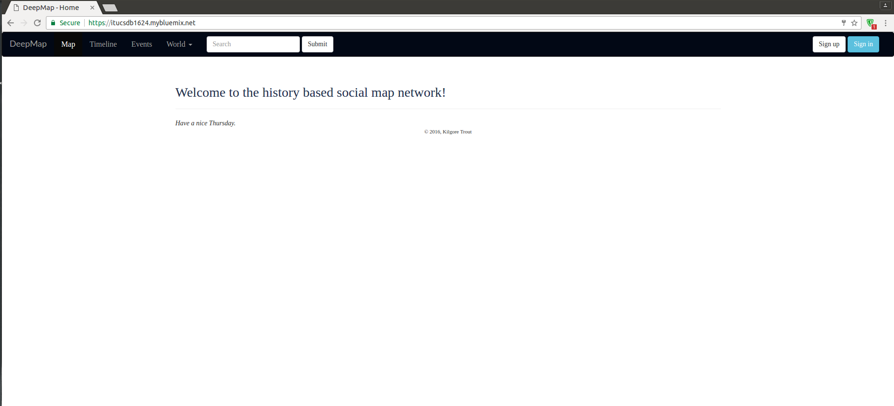

Welcome to Deep Map documentation!
===================================

:Team: itucsdb1624

:Members:

   * Muhammed Safa Çelik
   * Emine Öykü Bozkır
   * Nihat Mert Çiçek
   
Deep Map, İtü Bilgisayar ve Bilişim fakültesinin Veritabanı Yönetim Sistemleri Dersinin dönem projesi olarak hazırlanmış bir sosyla medya sitesidir. Bu sosyal medya sitesi kullanıcılarına çeşitli güncel veya tarihi olayların konum ve zamanları hakkında harita üzerinde işaretleyip yazı yazma, fotoğraf ve video paylaşma imkanı vererek tüm kullanıcıların erişebileceği, yorum yapabileceği bir tarih şeridi oluşturur. Ayrıca kullanıcılar, kayıt olarak kendi hariralarını oluşturabilir, arkadaş edinebilir, arkadaşlarının haritalarını görebilir ve yorumlayabilirler. Arkadaş olarak eklenen kullanıcılar ile mesajlaşma başlatabilirler.

   DeepMap

Contents:

.. toctree::
   :maxdepth: 1
  
   installation/index
   user/index
   developer/index
