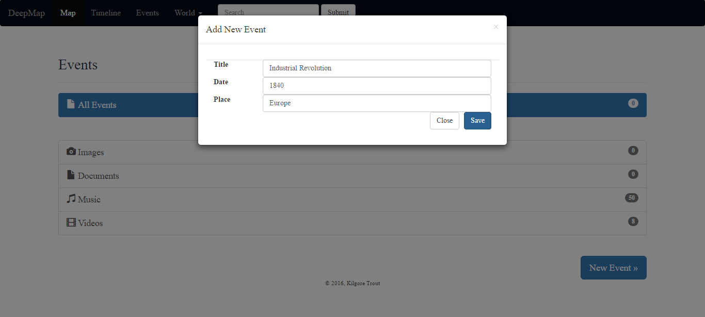
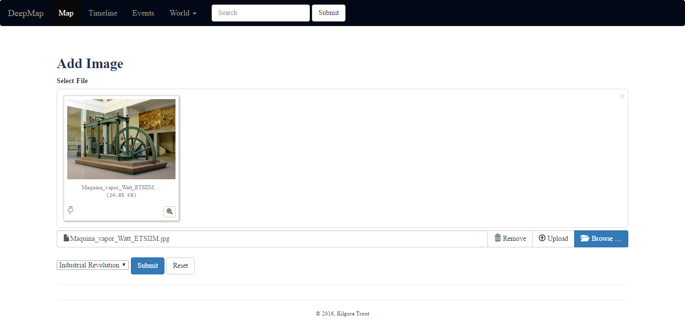

Nihat Mert Çiçek Tarafından Gerçeklenen Bölümler
================================
Olaylar (Events) Sayfası
-----------------------

**Genel** Olaylar sayfasında kullanıcı olay ekleyebilir, tüm olayları görüntüleyebilir ve olaylara eklenen resim ve dökümanlara erişebilir.

   Olaylar Sayfası

**Ekleme** 

* Kullanıcı "New Event" butonuna tıklayarak olay ekleme sayfasına erişir.

* "Title", "Date" ve "Place" alanlarını doldurduktan sonra "Save" butonuna tıklayarak yeni olay eklenebilir.

* "Close" butonuna tıklayarak olaylar sayfasına geri dönüş yapılabilir.

   Olay Ekleme Sayfası

**Listeleme** 

* Kullanıcı eklenmiş olan tüm olaylara "All Events" butonuna tıklayarak erişebilir.

   Olay Listeleme Sayfası

**Silme** 

* Kullanıcı silmek istediği olayların "Delete" sütunlarındaki kontrol kutularını işaretler.

* Ardından "Delete" butonuna tıklayarak seçmiş olduğu olayları siler. 

Bir olayın silinmesi durumunda o olayla bağlantılı olan tüm resimler ve dökümanlar da silinir. 

   Olay Silme İşlemi

İstisnalar
+++++++++++++++++++

* Kullanıcı olay ekleme sayfasında herhangi bir alanı boş bırakması durumunda uyarı mesajı alacaktır.

   Olay Ekleme Uyarısı
   
* Herhangi bir olay eklenmeden tüm olaylar, resimler veya dökümanlar görüntülenmek istenirse kullanıcı uyarı mesajı alacaktır.

   

   Olay-Resim-Döküman Görüntüleme Uyarısı
   
   
Resimler Sayfası
------------------
**Genel** Resimler sayfasında kullanıcı yeni resim ekleyebilir, eklenmiş resimleri silebilir ve görüntüleyebilir.

   Resim Görüntüleme Sayfası

**Ekleme** 

* Kullanıcı "New" butonuna tıklayarak resim ekleme sayfasına erişir.
* "Browse" ile yüklemek istediği resmi seçer.
* Resmi yüklemek istediği olayı aşağıya doğru açılan menüden seçer ve "submit" butonuna tıklar.

   Resim Ekleme İşlemi

**Silme** 

* Kullanıcı silmek istediği resimlerin altındaki "Delete image" kontrol kutularını işaretler.

* Ardından "Delete" butonuna tıklayarak seçmiş olduğu resimleri siler. 

   Resim Silme Operasyonu

İstisnalar
+++++++++++++++++++

* Kullanıcı resim ekleme sayfasında yüklemek istediği resmi seçmeden "submit" butonuna tıklarsa uyarı mesajı alacaktır.

   Resim ekleme hata sayfası

Dökümanlar Sayfası
--------------------------

**Genel** Kullanıcı dökümanlarını görüntülemek istediği olaya tıklar.

   Dökümanlar Sayfası.

**Ekleme** 

* Kullanıcı "New" butonuna tıklayarak döküman ekleme 'modal'ını açar.

* "Title", "Date" ve "Content" alanlarını doldurur ve aşağıya doğru açılan menüden eklemek istediği olayı seçer.

* "Save" butonuna tıklayarak yeni dökümanı ekleyebilir veya "Close" butonu ile eklemekten vazgeçebilir.

   Döküman Ekleme İşlemi

**Silme** 

* Kullanıcı silmek istediği dökümanların altındaki "Delete" kontrol kutularını işaretler.

* Ardından "Delete" butonuna tıklayarak seçmiş olduğu dökümanları siler.

   Döküman Silme İşlemi

**Güncelleme** 

* Kullanıcı güncellemek istediği dökümanın yanındaki "update" butonuna tıklayarak güncelleme sayfasına ulaşır.

* Eski bilgilerle doldurulmuş olan alanlarda istenen düzenlemelerle yapılır.

* İlgili olay aşağı doğru açılan menüden seçilir ve "save" butonuna tıklayarak döküman güncellenir veya "back" butonu ile güncelleme işleminden vazgeçilir.

   Döküman Güncelleme İşlemi

İstisnalar
+++++++++++++++++++

* Kullanıcı döküman ekleme sayfasında herhangi bir alanı boş bırakması durumunda uyarı mesajı alacaktır.

   Döküman Ekleme Uyarısı
